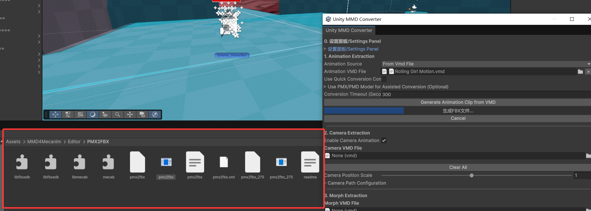
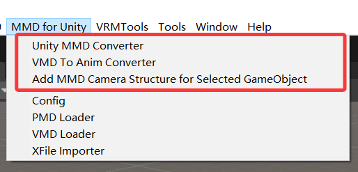
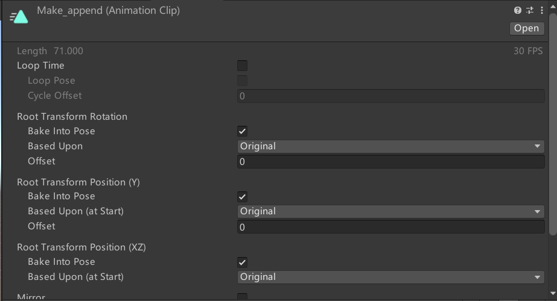

# UnityMMDConverter

**Other Language Versions: [English](README.md), [中文](README_zh.md)**

This tool focuses on converting MMD (MikuMikuDance) files into Unity-compatible `.anim` files and animation controllers, while adding facial expressions and camera curves. It streamlines many tedious and time-consuming tasks using scripts.

1. **Toolbox Plugin**  
   Download: [https://github.com/maoxig/UnityMMDConverter/releases/](https://github.com/maoxig/UnityMMDConverter/releases/)

2. **MMD4Mecanim**: [http://stereoarts.jp/](http://stereoarts.jp/)  

**Regarding MMD**: This video/tool merely integrates existing tools and workflows. When converting or using MMD files, please adhere to the original MMD regulations and respect relevant copyrights. The author and this tool are not responsible for any damages caused to secondary users.

Some already converted dance `.unity3d` files (about 300) can be downloaded here:
https://drive.google.com/drive/folders/1YU7-Hz-O8-9B2E58mxQxexJTBTCT42jr?usp=sharing

Below is the detailed tutorial. At the end, you’ll find a section on potential issues. It’s recommended to follow the tutorial first. If problems arise, refer to the principles, known issues, and troubleshooting steps. If issues persist, feel free to provide feedback.

---

## Tutorial

### 0. Project Preparation

Prepare Unity, **MMD4Mecanim**, and this Unity toolbox plugin.

To import the Unity package, drag the `.unitypackage` file into the Unity Project window. If prompted during import, click "Yes."

After installing MMD4Mecanim, you will see the following tools:

### 1. Verify Toolbox Functionality

After importing the toolbox plugin, you’ll see new options in the Unity menu bar, specifically **Unity MMD Converter** and **VMD To Anim Converter**.

The **VMD To Anim Converter** is a tool for converting `.vmd` files to `.anim` files (an optimized re-encapsulation of MMD4Mecanim). You can verify the configuration paths in the settings.

Open the **Unity MMD Converter** to access the main plugin window. Note: The default configurations are pre-set and should not be changed unless necessary.

### 2. Prepare MMD Files

Place the MMD motion `.vmd` files (motion, camera, and facial expression `.vmd` files) and audio files (`.mp3`, `.ogg`, or `.wav`) into your Unity project. For organization, consider creating a `Workspace` folder.

### 3. Generate Animation Clips from VMD or Use Existing Clips

There are two scenarios:

1. **Only VMD Files Available**: Drag the `.vmd` file into the tool and click to generate an animation clip.
2. **Existing `.anim` Clip**: If you’ve previously generated an animation clip, you can directly import it using the provided option.

After generating the animation clip, an `.anim` file will be created. Initially, this file contains only character motion data. Camera and facial expression data will be added in later steps.

If an error occurs during generation, use MMD4Mecanim to extract the `.anim` clip and then import the existing clip.

### 4. (Optional but Recommended) Import Camera VMD

If the camera and motion data are combined in a single `.vmd` file, drag the same `.vmd` file used previously.

**New Feature**: The toolbox includes a camera scaling option. For example, if a camera `.vmd` is designed for a 1.8m-tall character, but your character is 1.6m tall, scale the camera by a factor of 1.6/1.8 = 0.88 when importing the `.vmd`.

### 5. Import Facial Expression VMD

Typically, facial expressions and motion are included in the same `.vmd` file, so you can reuse the previous `.vmd`. However, the panel also supports separate files.

### 6. Combine Animation Curves and Create Controller

Preview the morph key mappings, select the curves you want to add, and click **Add to Animation and Create Controller**.

If the creation fails, try deselecting some morph keys and retry.

A one-click preview button is available using Unity’s Timeline. Drag an existing character model into the designated slot and click to preview:

To preview the camera in Unity, use the provided script `Add MMD Camera for selected object` to create a compliant camera node. Select the model, click the option to create the script, and then click the button. Afterward, click the Timeline’s play button to directly view the camera motion in the Game window without needing to play the game. This combines the last three steps into one, significantly improving inspection efficiency.

### 6.5 Audio Check (Optional)

Ensure the audio file is appropriately sized. Verify that the audio aligns with the motion and syncs correctly.

- **Case 1**: If the motion distribution includes an audio file, drag it in directly.
- **Case 2**: For self-downloaded music, verify the beat alignment and adjust the audio if necessary. Use Unity’s Timeline or external tools like `ffmpeg` for adjustments.

### 7. Character Orientation Check (Optional)

Preview the newly created animation in the `Output` folder. Ensure the character’s facing direction (red arrow) aligns with the blue arrow. If misaligned, adjust the **Root Transform Rotation** panel.

If the character’s initial position is incorrect, try setting the **Center of Mass** to "Original."

### 8. Final Check (Optional)

Use an existing character model (e.g., a VRM model) to verify that the skeleton, motion, facial expressions, and camera work correctly. Drag the generated controller to the character model’s Animator component and click "Play" to animate the character.

Alternatively, use Timeline for inspection, as it allows simultaneous checking of audio, motion, and camera without needing to play the game.

### 9. Package and Export

If everything is correct, click the package button to export. The tool automatically detects, renames the controller, animation, and audio, and outputs a `.unity3d` file. Set the output path to the `dances` folder to check the results directly in-game.

---

## Potential Issues

1. **Lip Expression Parsing Errors**: If lip expressions fail to parse, re-import the lip data in MikuMikuDance and re-export the `.vmd` file to refresh it.

2. **Motion Issues with VMD Files**: Some `.vmd` files rely heavily on the bone structure of the `.pmx` model. If errors occur, try using a more compatible `.pmx` model or modify the model’s bones using PMX Editor.

3. **Incorrect Initial Position or Orientation**: If the extracted `.anim` clip has correct motion, expressions, and camera but the initial position or direction is off, adjust the panel options in Step 7.

## Acknowledgments
https://github.com/ShiinaRinne/MMD6UnityTool